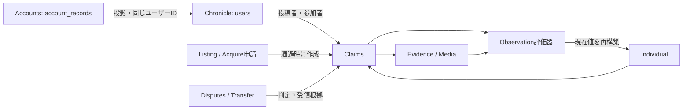

# 現行データベース構造

対象：2026-10-04のローカルSQLite実装。目的は保存先・正本・関連・復元境界の把握。概念と判定規則は[Claim中心の設計](CLAIM_CENTERED_ARCHITECTURE.md)、将来のPostgreSQL / Identity Platform構成は[GCP移行境界](../migration/GCP_BOUNDARIES.md)に分ける。

## 物理的な保存先

既定のデータルートは `app/data`。`YGC_DATA_DIR`で変更でき、ChronicleとAccountsは専用のパス設定も持つ。

| DB・バックアップ対象 | 既定ファイル（データルート相対） | 正本となる情報 |
| --- | --- | --- |
| Chronicle / `chronicle` | `chronicle.db`（`YGC_DB_PATH`で変更可能） | 個体、Claim、根拠、正式申請、係争、収集状態、コンテンツに紐づくユーザー情報 |
| Accounts / `accounts` | `accounts.sqlite`（`YGC_ACCOUNTS_DB_PATH`で変更可能） | アカウント識別、Profile、認証ID対応、ローカルセッション、同意、Follow、DM |
| Operations / `operations` | `operations.sqlite` | サービスモード、Auto Crawl・審議反映スイッチ、バックアップ設定、停止中に受信した回答 |
| Authentication / `authentication` | `direct-review/queue.sqlite3` | GPT実験用キュー、接続キー、結果・履歴。正式申請とは別 |

画像はDBだけでは完結しない。コンテンツ画像は `media`、アカウント画像は `account_media` に保存する。DB行が保存パスや画像情報を参照する。正式申請・実験キューには画像ペイロードを保持する列もある。保存済みバックアップは `crawl_backups` にZIPとメタデータJSONで保存する（名称は旧Crawl機能由来）。

## 正本と投影

Accountsの `account_records` がアカウントの正本。数値 `id` と不変のUUID `app_user_id` を保持し、認証主体は `identity_links` のissuer / tenant / subjectからUUIDへ対応づける。Google側の識別子をギターの主キーとして使わない。

Chronicleの `users` は既存コンテンツ参照用の投影。Claim作成者、Owner、通知などは数値ユーザーIDを参照する。`signature_individual_id` はコンテンツ側に残す。FollowとDMもAccountsを正本とし、Chronicleへ投影する。アカウントDBをATTACHし、TEMP triggerと投影処理で同期する。クロスDBの原子的コミットのためDELETE journal modeを前提とし、WALのメインDBはこの処理で拒否する。

`individuals` は一個体のIDと現在値Snapshotを保持する。Claim・EvidenceからObservation評価器が再構築する。論理上のObservation評価器と、移行互換用 `observations` テーブルを同一視しない。

矢印は処理・参照関係を示し、外部キーの完全図ではない。全カラム・制約は `app/src/ygc/db/schema.sql` とRepositoryの初期化・互換更新処理が根拠。

## Chronicleのテーブル群

| 領域 | テーブル | 役割 |
| --- | --- | --- |
| 個体・参加者 | `individuals`, `users`, `user_guitars`, `user_favorites` | Snapshot、ユーザー投影、所有履歴分類、お気に入り |
| 主張・反応 | `claims`, `claim_responses`, `claim_votes` | 主張本体、Response、Good / Bad |
| 型別項目 | `claim_spec_items`, `claim_listing_items`, `claim_identity_items` | 仕様、掲載、識別訂正の複数項目 |
| 根拠・画像 | `media_assets`, `claim_evidence`, `claim_source_evidence`, `claim_specification_source` | 画像とClaimの関連、外部掲載・取得日・抽出元情報 |
| 譲渡 | `claim_transfers`, `claim_transfer_acceptance` | 相手・応答状態、受領時点のOwner・日時 |
| 正式申請 | `acquire_applications`, `acquire_application_events` | Listing / Acquire共通申請、写真・診断・Claim紐付け、処理履歴 |
| 係争 | `ownership_disputes`, `ownership_dispute_claims`, `ownership_declines`, `ownership_dispute_evidence`, `ownership_dispute_events`, `ownership_dispute_rounds`, `ownership_dispute_round_parties`, `ownership_dispute_round_evidence` | 対象、当事者、却下理由、非公開根拠、裁定、提出ラウンド |
| 通知・交流投影 | `notifications`, `user_follows`, `direct_messages` | コンテンツ通知、Follow / DM投影 |
| 収集進行・キャッシュ | `crawl_runs`, `crawl_programs`, `crawl_listing_checks`, `crawl_listing_cache`, `crawl_detail_cache`, `crawl_candidates` | 実行ログ、検索位置、既知掲載検査、詳細・候補の保持 |
| 未登録・旧互換 | `crawl_unregistered_records`, `legacy_crawl_archive`, `observations` | 未登録入力の保全、旧記録の退避・互換読取 |
| 管理履歴 | `claim_admin_actions`, `user_admin_actions`, `individual_resolution_actions` | 強制判定、BAN、Merge等の管理記録 |

Claimの `status`（有効性）と `verification_status`（判定）は別の軸。申請の `status` やTransferの `state` とも別。現在OwnerやOwned分類を単独の申請ステータスだけで判定しない。[所有状態と判定権限の不変条件](CLAIM_CENTERED_ARCHITECTURE.md)に従う。

## その他のDBのテーブル

| 保存先 | テーブル | 役割 |
| --- | --- | --- |
| Accounts | `account_records`, `account_metadata` | 不変のID対応、Profile・停止状態、初期化管理 |
| Accounts | `identity_links`, `local_sessions`, `account_consents` | 外部認証主体対応、期限付きダミーセッションのハッシュ、同意記録 |
| Accounts | `account_user_follows`, `account_direct_messages` | Follow / DMの正本 |
| Operations | `settings`, `events` | モード・メッセージ・設定版、操作履歴 |
| Operations | `auto_crawl`, `review_settings`, `paused_review_answers` | 自動収集、GPT反映スイッチ、停止中の回答 |
| Operations | `backup_settings`, `backup_schedules` | 旧保持設定、対象別の周期・世代数・実施結果 |
| Authentication | `settings`, `jobs`, `events` | 実験接続設定、審議キュー・画像・結果、試行履歴 |

一部テーブルは機能初回使用時に作成される。Accountsの列はChronicleのusersから初期化時に組み立てるため、schema.sqlだけでは実際のスキーマ全体にならない。

## 保存・復元の境界

対象別保存により、Crawl前はChronicleだけを保存できる。Chronicle復元では現在のAccountsを正本としてユーザー・交流の投影を再構築し、登録アカウントを過去へ巻き戻さない。復元データに未知のアカウントや数値IDとUUIDの衝突がある場合は拒否し、対応する登録簿または明示的なID対応が必要となる。

Accounts復元はProfile・交流を戻す操作。既存IDを別人に再割当てしない。バックアップ後に追加されたアカウントのIDは保持するが無効化するため、Accounts復元自体にはログイン可否への影響がある。既存認証主体の対応も保護し、ローカルセッションは保存・復元から除外する。

Operations復元はモード・スイッチ・周期設定などを戻す。Authentication復元は実験データと接続設定を戻し、ギターの所有状態は変更しない。DBごとのZIPは対象のDBと必要な関連ファイルを扱い、4つ全体の同一時点スナップショットではない。

操作条件・世代管理は[サービス運用仕様](../features/SERVICE_OPERATIONS.md)、実施手順は[運用ガイド](../operations/README.md)。

## 実装の参照先

- `config.py`：保存先。
- `db/schema.sql` / `db/repository.py`：ChronicleのDDL、初期化・互換更新・参照。
- `accounts.py`：Accounts初期化、投影、ID保護と復元。
- `operations.py` / `crawl_backups.py`：運用DBと対象別保存。
- `direct_queue.py`：実験キューのDDL。

いずれも `app/src/ygc` 配下。DDL変更時は本書の表と正本・復元境界を更新する。実DBを開いて文書を生成する必要はない。
