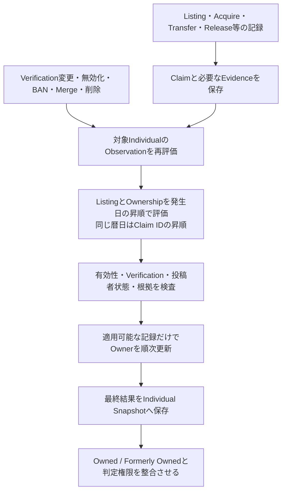
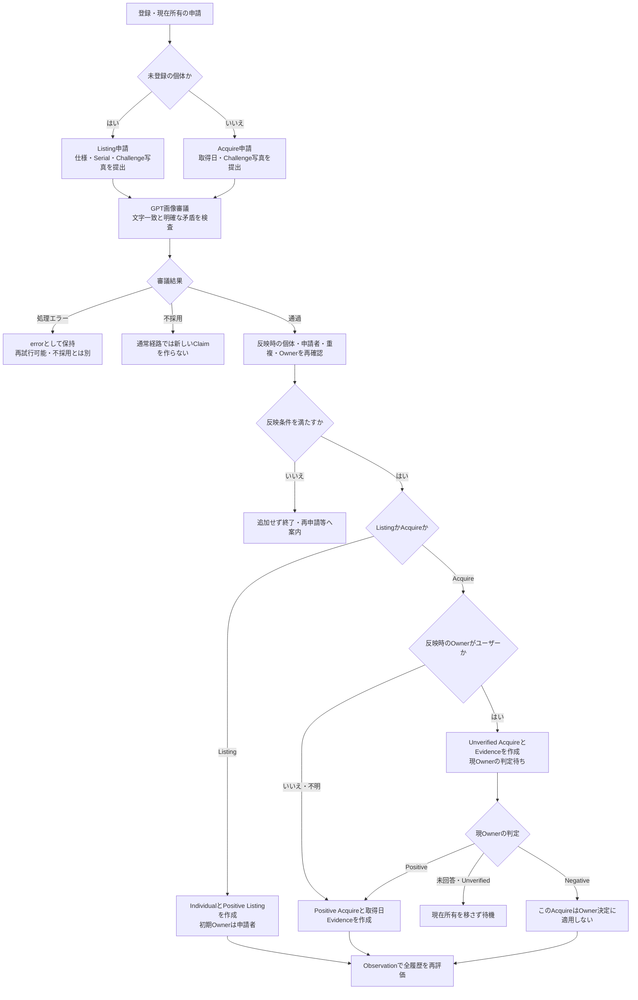
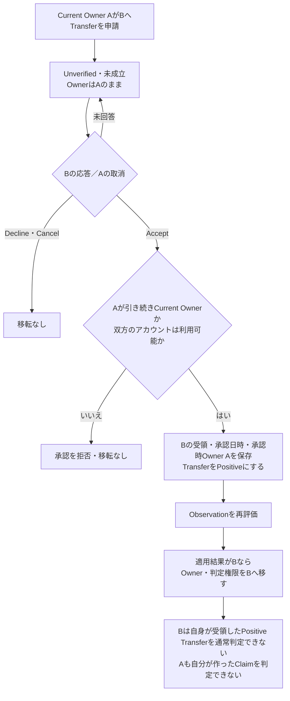
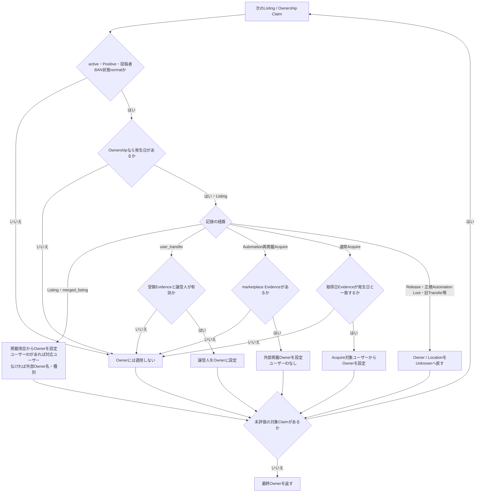
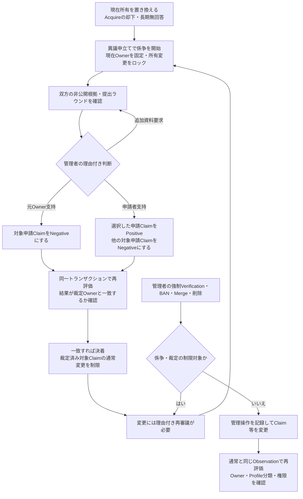

# Ownership Decision — IndividualのOwner決定フロー

対象：現行ローカル実装。Ownerはサービス内で採用した所有情報であり、法的な所有権の保証ではない。申請の採否、ClaimのVerification、IndividualのCurrent Ownerは別の状態として扱う。

本書はOwner決定の流れを図示する。厳密な不変条件は[Claim中心の設計](../architecture/CLAIM_CENTERED_ARCHITECTURE.md)、保存構造は[DB構造](../architecture/DATABASE_STRUCTURE.md)、操作手順は[ユーザーガイド](../user-guide/README.md)と[管理操作ガイド](../operations/README.md)を参照。

## 1. 全体：記録から現在Ownerを求める

Ownerを直接選んでSnapshotへ保存するのではなく、ClaimとEvidenceをObservationが評価する。評価は新規申請だけでなく、判定変更・無効化・BAN・管理操作後にも行う。

後から投稿されたClaimが必ずCurrent Ownerになるわけではない。取得日などの発生日と後続の有効な履歴を含めて評価する。過去日付のAcquireが承認されても、後続記録により現在Ownerが維持され、申請者はFormerly Ownedに分類される場合がある。

## 2. 新規登録と現在所有Acquireの申請

これは通常ユーザーの正式申請経路。外部収集・Former Owner履歴登録・Transferには同じ写真審議を要求しない。

シリアル不明や必要写真未提出などは申請・提出段階で拒否される。Challengeの提出期限は24時間。同じ正規化Maker・Serialの個体がある場合、新規Listingを作らず既存Acquireへ案内する。審議中に申請者がすでにCurrent Ownerになった場合も追加しない。OFF中のChatGPT回答は保持し、審査中データへ反映しない。

画像審議通過は既ユーザーOwnerの承認を代替しない。現Owner AがBのAcquireをPositiveにし、全履歴評価の結果OwnerがBへ移ると、判定権限もBへ移る。Aは以後Ownerとして判定できず、Bも自分のAcquireを自己判定できない。[申請詳細](OWNERSHIP_REQUESTS.md)を参照。

## 3. ユーザー間Transfer

再評価では受領Evidenceの整合性を検査する。Fromの所有者確認は受領時に実施済みで、過去のTransferの再評価結果には依存させない。A→B→Cの後にA→Bを否定・無効化・削除しても、B→Cが自身の適用条件を満たせばCの所有・分類・判定権限を維持する。

合意EvidenceとVerificationは別。管理者がVerificationを変更しても受領Evidenceは残り、Acceptの再送で管理者判定を上書きしない。[Transfer詳細](TRANSFER_CLAIM.md)を参照。

## 4. Observation内のOwner評価

全体フローの「適用可能な記録だけでOwnerを順次更新」を展開する。Owner初期値は未設定。対象Claimを古い発生日から順に走査し、後の適用可能な記録がOwner値を更新する。

Automation Lostは正規のAutomation作成記録だけを適用する。掲載由来の現在値が追跡不能になったことを表し、ユーザーの所有放棄やIncident / Lostとは別。外部掲載が現在値の唯一の根拠だった場合に生成し、ユーザーOwnerを新たなLostで消さない。旧Transfer / Inherit等のUnknown化は読取互換で、新規ユーザー間Transferは受領経路を使う。

ListingをNegativeにしても識別用のMaker等を残す処理があるが、Owner採用条件は別であり、この図の共通条件を満たさなければOwnerには適用しない。画像審議・投票数・FollowはOwnerを直接決めない。Former Ownerの正規Acquire / Releaseペアはまとめて判定し、適用される両記録を時系列に評価する。

## 5. 係争と管理者の別経路

裁定結果と再評価Ownerが一致しない場合は決着処理を確定せず拒否する。再審議にも現在Ownerとの整合などの条件がある。係争中・裁定済みClaimを通常の管理者強制判定で迂回しない。

管理者の画像審議採否上書きとVerification強制変更も別操作。採用上書きだけでは既ユーザーOwnerの承認を代替しない。不採用への上書きは既存ClaimをNegativeにして再評価する。[係争](OWNERSHIP_DISPUTES.md)と[管理操作](../operations/README.md)を参照。

## 実装と遷移例の対応

評価処理は `app/src/ygc/observation_evaluator.py`、Snapshot・通常判定は `db/repository.py`、申請は `acquire_review.py` / `listing_review.py`、係争は `disputes.py` が担う。

| 確認する遷移 | 既存テストの参照先（app/tests配下） |
| --- | --- |
| Acquire承認待ち、現Ownerの承認、審議中Owner変更、過去日付、非ユーザーOwner | `test_acquire_review.py` |
| Transfer前後のOwnerと権限、自己判定禁止、前段Transfer変更後の後段維持 | `test_transfer_claim.py` |
| 管理者によるApprove / Reject・ペア変更とSnapshot再評価 | `test_admin_moderation.py` |

設計文書の遷移例とこれらの実装・テストを併せて確認する。本書追加では動作を変更せず、既存処理を図示している。
