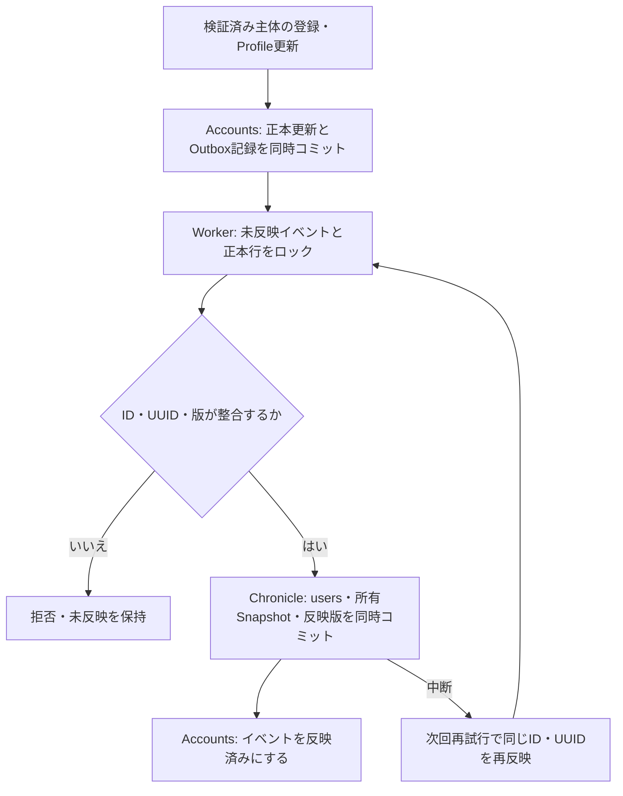

# PostgreSQLのAccounts同期と所有判定

更新日：2026-10-04。DB層、認証検証、[登録API](CLOUD_ACCOUNT_REGISTRATION.md)はmainへ統合済み。独立した認証確認画面をCloud Runへ配置し、利用者の基本認証試験が完了。[Accounts同期Job](ACCOUNT_PROJECTION_JOB.md)を実配置し、初回同期・Schedulerからの再実行が成功した。所有権Webルートは未接続。

## 正本と同期

AccountsがユーザーID・UUID・Profile・認証主体対応・role・disabledの正本。Chronicleのusersはコンテンツの参加者投影で、数値IDとUUIDを一致させる。ChronicleのユーザーID採番でアカウントを作らない。認証主体はissuer / tenant / subjectでAccountsのidentity_linksから解決する。tenantを表現できない旧identity_provider / identity_subject列はChronicleではNULLとし、認証に使わない。roleとdisabledも投影しない。

`PostgresAccounts.ensure_identity` は検証済み主体の登録を直列化し、同じ主体の再実行・同時登録で別アカウントを作らない。アカウント・認証対応・同意・同期待ち記録をAccounts内で同時にコミットする。このメソッドはトークン検証器ではない。ブラウザから送られたissuer、subject、ユーザーIDをそのまま信頼するHTTP APIには接続しない。

Profileの変更は許可項目に限定する。ID・UUID・role・disabled・BANを通常のProfile更新には含めない。アカウントID／UUIDの変更・削除と認証主体の再割当てはDBトリガーでも拒否する。Admin付与・停止・BANの管理画面と監査経路は今後の接続対象であり、通常ユーザーへ公開していない。

更新時にはDBトリガーがprojection_versionを進め、account_projection_outboxへ記録する。更新と同期待ち記録は同じAccountsトランザクション。記録にはID・UUID・版・日時だけを保持し、パスワードやトークン、Profile本文を複写しない。



Workerは最新の正本を読み、Chronicleの投影と反映版をコミットした後でOutboxを完了にする。途中中断は再試行で回復でき、ユーザーやClaimを重複作成しない。衝突やSnapshot再評価失敗はイベントを未反映のまま残す。例外を握り潰して次へ進む処理にはしていない。

role・disabled・ログイン可否は毎回Accountsの正本で判断する。コンテンツ変更には、関係するClaim作成者・Owner・譲受人等の正本行を共有ロックし、Chronicleの反映版とProfileが一致することを確認する境界を用意した。同期待ち・未知のID・衝突は変更を拒否する。主体の認証、操作ごとの権限判定、メンテナンス制御は別途必要。

## 移植した業務処理

`PostgresOwnership` はサーバーが解決したActorContextを受け、Owner Verification対象の取得・判定変更、Transfer提案・応答、Adminの強制判定を実行する。未検証Actor、数値IDとUUIDの不一致、非Adminの強制判定は拒否する。無効化された相手へのTransfer提案と、当事者の無効化後の受領もAccounts正本で拒否する。Claimの対象個体や参加者が事前読取りから変わった場合も、書込み前に拒否する。

SQLite版とPostgreSQL版で判定ルールを複製せず、Repositoryのトランザクション内処理とObservation評価器を共有する。パラメーター記号だけをドライバーに合わせ、SQLite固有SQLを実行時に推測して置換する処理は使わない。共有したINSERTは明示的なRETURNINGで生成IDを取得する。

Profileの表示名・所属・地域・BANが変わる投影では、関係するIndividualのSnapshotとOwned / Formerly Ownedを同じChronicleトランザクションで再構築する。所有権・判定権限の規則は[Claim設計](../architecture/CLAIM_CENTERED_ARCHITECTURE.md)に従う。Acquireの画像審議とClaim作成は未接続であり、審議を省略する新しいAcquire入口は設けていない。

## 初期化と復元への準備

001の初期化後、スキーマ所有者で以下を実行する。

```bash
python -m ygc.db.postgres migrate --target accounts --password-prompt
python -m ygc.db.postgres migrate --target chronicle --password-prompt
```

接続設定は[初期化手順](POSTGRES_BOOTSTRAP.md)。002の移行とバージョン記録は対象DBごとのトランザクション。既存の必須項目NULL等は修正を推測せず拒否する。再実行はappliedの空配列となる。実行用ygc_appでは移行しない。

Chronicleだけを初期化・復元した後、現在のAccountsから `reconcile_projection` で投影を再構築できる。これは管理者が書込み・Workerを停止した状態で呼ぶDB層の処理で、Browser ConsoleのReset / Restore操作にはまだ接続していない。未知のユーザー、数値IDとUUIDの衝突、Accountsの版が投影の版より過去へ戻ったケースは拒否する。Accounts正本やコンテンツのClaimを削除せず、コンテンツ側のsignature guitarを通常の投影更新で上書きしない。

## 検証と残作業

使い捨てPostgreSQL 18で以下を検証する。

- 002移行と再実行、同時・重複登録、tenant分離、登録失敗時の全件ロールバック。
- 同期待ちのコンテンツ操作拒否、正本での即時停止、Profileによる権限変更の拒否。
- Chronicleコミット後の中断・再試行、ID／UUID衝突、コンテンツ初期化後のAccounts保持・再投影、未知の参加者の拒否。
- Acquire承認前後のOwnerとOwned分類、自己判定禁止、旧Ownerの権限喪失、Transfer受領者の自己否定禁止。
- A→B→CのTransfer成立後、先行TransferをAdminが否定・Unverified化・削除してもCを維持すること、Adminの別経路と監査actor、BANに伴うSnapshot再評価。

WebUI全Repository・画像審議・Crawl・Follow / DM・運用設定・独立バックアップ／復元／リセットは未移植。Identity Platformは独立した認証確認画面で接続済み。Cloud Storageのアプリ接続と現行WebUI移行は残る。同期Workerの実配置状況は[Accounts同期Job](ACCOUNT_PROJECTION_JOB.md)を参照。現行ローカルWebUIをそのままCloud Runへ配置することはできず、起動制限を維持する。

### 後続接続の更新（2026-10-05）

上の未移植一覧はDB基盤実装時の記録。現時点ではCrawl、Operations、DB別バックアップ／復元／初期化、Admin用の個体・ユーザー・Chronicle閲覧を接続済み。今回Admin強制判定のPositive / Negative / UnverifiedをConsoleへ接続する。通常Owner判定とTransferのブラウザ操作、申請審議、Follow / DM等は未接続。現在の範囲と利用者受入は[クラウドBrowser Console](CLOUD_BROWSER_CONSOLE.md)を参照。
